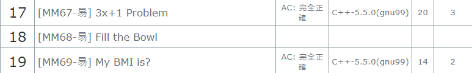
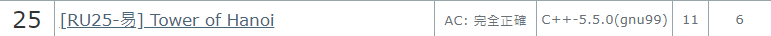

# ITSA 加分
#### 資工二 409410041 陳柏仲
## 完成題目
共34題

AR: AR08 AR12 AR19 AR20 AR22 AR27 AR28 AR42 AR43 (共9題)

DP: DP03 DP09 DP10 DP25 (共4題)

MM: MM01 MM23 MM31 MM36 MM52 MM60 MM67 MM69 MM102 MM116 MM133 MM137 MM138 MM141 (共14題)

RU: RU01 RU03 RU25 (共3題)

SO: SO05 SO06 (共2題)

ST: ST13 (共1題)

GA: GA44 (共1題)

